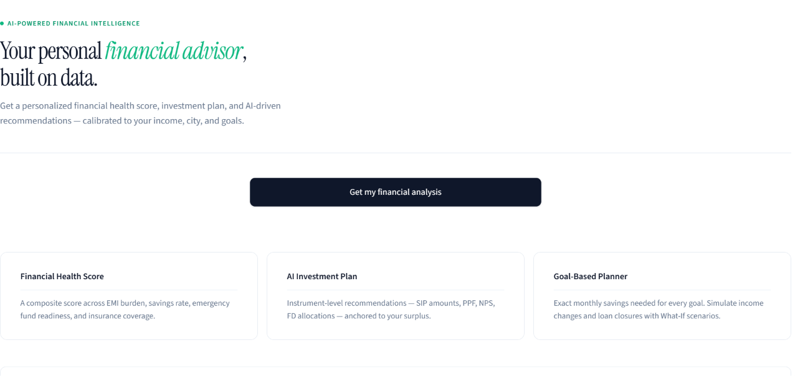
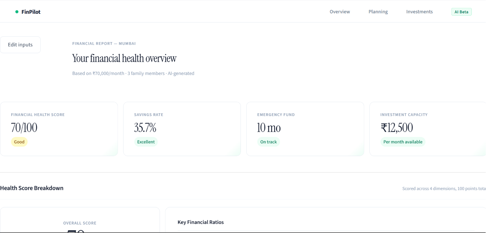
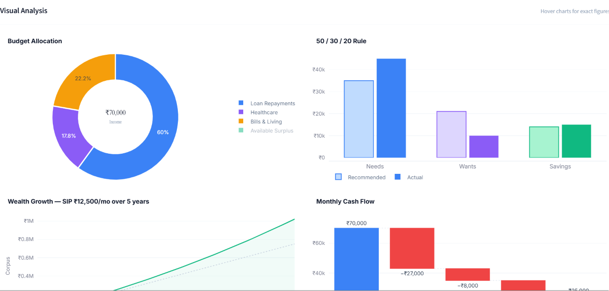
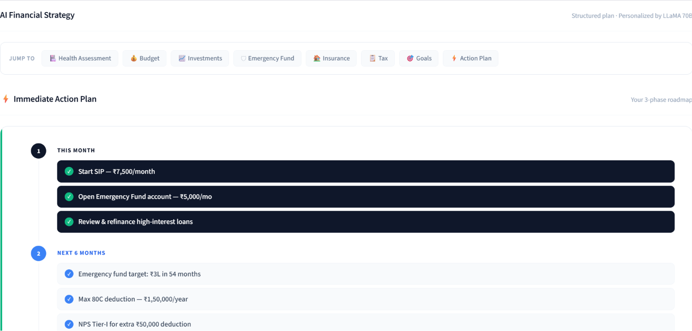
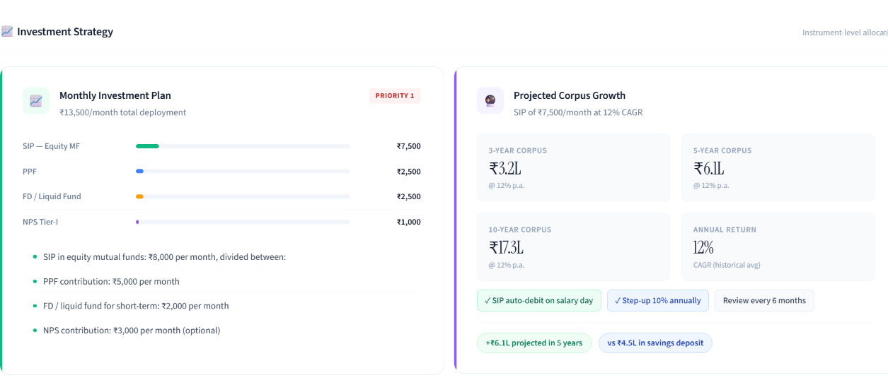
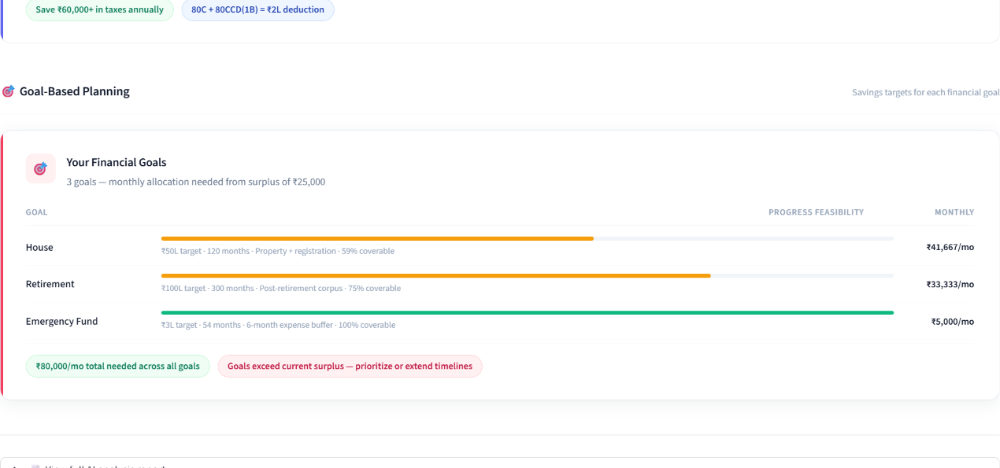
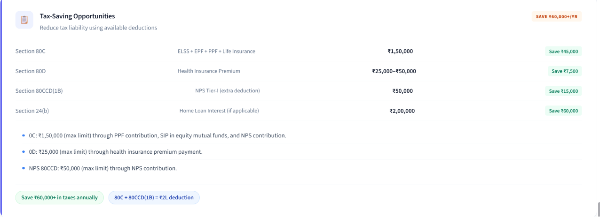

# 💰 FinPilot – AI Financial Planning Assistant

FinPilot is an AI-powered financial intelligence platform that helps users make smarter financial decisions through personalized budgeting, investment planning, insurance recommendations, emergency fund analysis, and wealth-building strategies.

Built using Generative AI, financial planning frameworks, and interactive analytics, FinPilot transforms raw financial data into actionable insights.

---

## ✨ Features

### 📊 Financial Health Score
- Comprehensive financial wellness assessment
- EMI burden analysis
- Savings rate evaluation
- Expense ratio monitoring
- Personalized health score out of 100

### 💵 Budget Optimization
- 50/30/20 budgeting framework
- Income allocation analysis
- Spending pattern recommendations
- Surplus utilization planning

### 📈 Investment Planning
- SIP recommendations
- Mutual fund allocation strategies
- PPF and NPS suggestions
- Wealth growth projections
- Long-term corpus estimation

### 🛡 Insurance Advisory
- Health insurance recommendations
- Term insurance coverage suggestions
- Family-based protection planning

### 🚨 Emergency Fund Planning
- Emergency corpus calculation
- Target-based savings roadmap
- Timeline estimation

### 🎯 Goal-Based Financial Planning
- House purchase planning
- Car purchase planning
- Retirement planning
- Child education planning
- Travel fund planning

### 📉 Interactive Analytics
- Budget allocation charts
- Wealth growth forecasting
- Financial dashboard visualizations
- Financial performance metrics

### 🤖 AI-Powered Financial Intelligence
- Personalized financial recommendations
- Actionable wealth-building strategies
- Risk identification
- Priority-based action plans

---

## 🏗 Tech Stack

### Frontend
- Streamlit

### Backend
- Python

### AI Layer
- Groq API
- LLM-powered financial analysis

### Data Visualization
- Plotly

### Supporting Libraries
- Pandas
- Python Financial Calculations

---

## 📷 Screenshots

### Dashboard


### Overview


### Wealth Analytics


### AI strategy


### Investment Strategy


### Goal Based Analysis


### Tax Strategy



---

## 🚀 Installation

Clone the repository:

```bash
git clone https://github.com/yourusername/FinPilot.git
cd FinPilot
```

Install dependencies:

```bash
pip install -r requirements.txt
```

Create a `.env` file:

```env
GROQ_API_KEY=your_api_key_here
```

Run the application:

```bash
streamlit run app.py
```

---

## 📌 Use Cases

- Personal Financial Planning
- Wealth Management
- Investment Strategy Creation
- Emergency Fund Planning
- Insurance Requirement Analysis
- Goal-Based Financial Decision Making

---

## 🔮 Future Improvements

- PDF Financial Reports
- Portfolio Tracking
- Stock & Mutual Fund Integration
- Real-Time Market Insights
- Tax Planning Engine
- Multi-user Support
- Financial Goal Progress Tracking

---

## 👨‍💻 Author

**Harsh Raj**

- LinkedIn: https://www.linkedin.com/in/harsh-raj-bbb18436a/
- GitHub: https://github.com/harshu290

---

## ⭐ Support

If you found this project useful, consider giving it a star on GitHub.

It helps the project reach more developers and motivates future improvements.